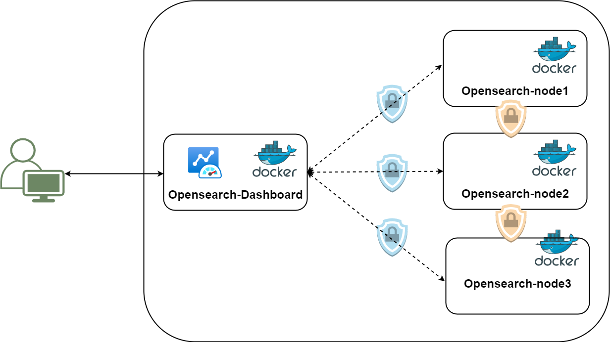

# OpenSearch Project


Dockerized cluster architecture for OpenSearch with compose.

## Description

This project deploys an OpenSearch cluster with 3 master nodes, 1 OpenSearch Dashboard node, and 1 Logstash node. The cluster uses SSL to secure communication between nodes, and the SSL certificates are generated as part of the deployment process.



## Key concepts

- OpenSearch = Elasticsearch
- OpenSearch Dashboards = Kibana

## Requirements

- Docker
- Docker Compose
- OpenSSL

## Pre-Deploy Step

Raise your host's ulimits for ElasticSearch to handle high I/O :

```
sudo sysctl -w vm.max_map_count=512000
```

To Persist this setting: 

Add the following line to `/etc/sysctl.conf`:

```
vm.max_map_count=512000
```

Reload the config as root:

```
sysctl -p
```

Check the new value:

```
cat /proc/sys/vm/max_map_count
```

## Deployment Steps

1. Clone the repository
```
git clone https://github.com/mrmoghadasi/ELK.git
```
2. Navigate to the project directory:
```
cd opensearch-project
```

3. Generate the certificates for the cluster:

```bash
./generate-certs.sh
```

4. Fixing permissions with:
```
chown -R 1000:1000 certs
```

5. Start the cluster using Docker Compose:
```
docker-compose up -d
```

6. Initialize the security plugin (after up all container):

```
./init-security.sh
```


The cluster should now be up and running, with the OpenSearch Dashboard accessible at `https://<dashboard-node-ip>:5601`.


## Configuration


### Change Password

To create a password for each user, enter the following command: 
```bash
docker-compose exec opensearch-node1 bash -c "plugins/opensearch-security/tools/hash.sh -p new_password"
```
This command creates a hashed password. Instead of `new_password`, enter the new password.

Users and passwords are configured in `internal_users.yml` file.

After adding or editing passwords in `internal_users.yml` , run this commands to apply the new passwords.

```
docker-compose restart
./init-security.sh
```

## Usage
Access OpenSearch Dashboards via `https://{{your_server_ip}}:5601`

Default username is `admin` and password is `mrm_pass`.


Test the connection:

```bash
curl -XGET --insecure https://localhost:9200 -u admin:mrm_pass
```

## Troubleshooting

- If any of the nodes fail to start, check the logs using `docker logs -f <container-name>`.
- If SSL certificate errors occur, regenerate the certificates by running the `./generate-certs.sh
` script again.

## License

[MIT](https://choosealicense.com/licenses/mit/) 
This project is licensed under the MIT License.

## Credits

This project was created by My User (mrm.elec@email.com)

[](https://www.linkedin.com/in/mohamad-reza-moghadasi-5755b959/) [](mailto:mrm.elec@gmail.com)
